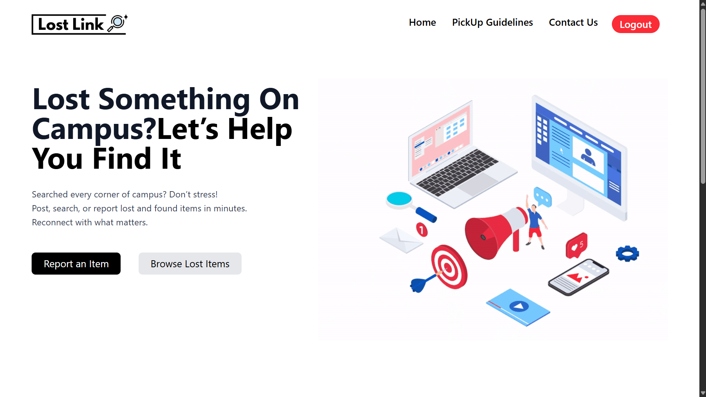
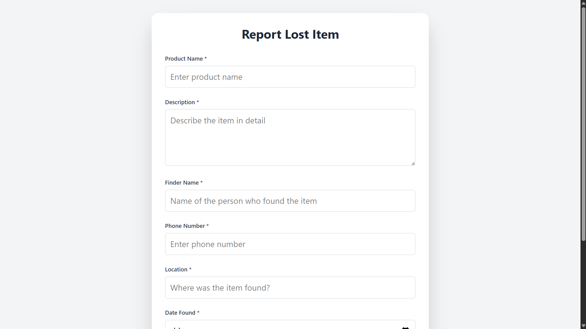
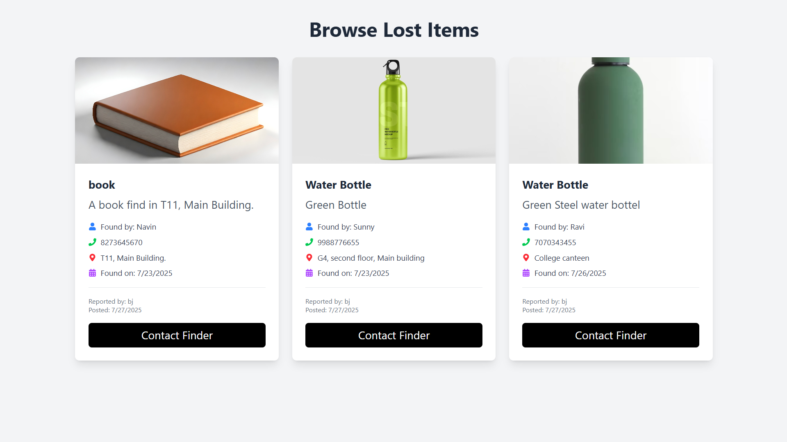
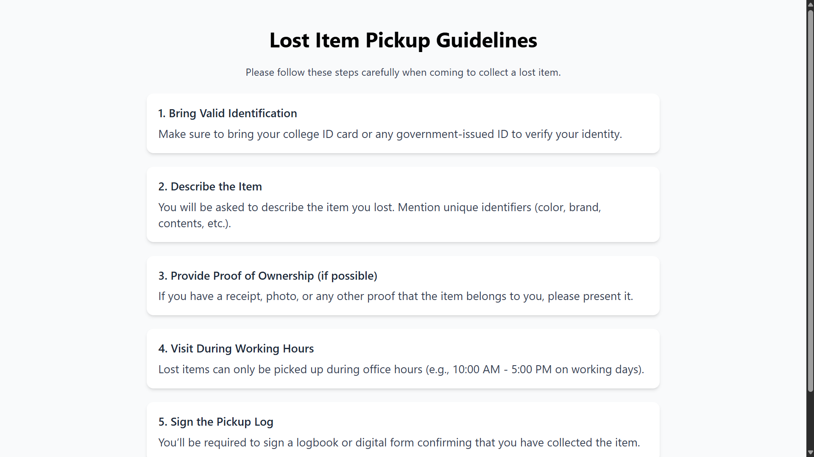

# Lost & Found Website 🔍

  A *Lost and Found* web platform designed especially for *Campus students 🎓* to report lost items they found  within their *campus environment* — making it easier to *reconnect lost belongings* like ID cards, phones, earphones, and more with their rightful owners.

⚙ Built using the powerful *MERN Stack*: MongoDB, Express.js, React.js, and Node.js.

---

## 📖 Project Summary

🎒 People often lose important items like phones, ID cards, earphones, and wallets in crowded places like campuses, hostels, or public areas. This platform serves as a *community-powered lost & found system* where users can:

- 🆘 Report if you founs any one's lost items.
- 🧾 Our Web Site show the list of recent reported(Lost Product) items .
- 🔎 Owner Search through items by category, location, or keywords.
- 🤝 Connect with finders or claimers.

---

## 🖼 Project Screenshots


### 🏠 Home Page
<div align="center">

</div>

### 📝 Report a Lost Item Form
<div align="center">

</div>


### 📋 View Latest Found Items
<div align="center">

</div>

### 📝 PikUP Guidelines
<div align="center">

</div>


---

## 🛠 Tech Stack — MERN 🚀

| Layer        | Technology 🔧            |
|--------------|--------------------------|
| 💻 Frontend   | React.js + Tailwind CSS  |
| 🧠 Backend    | Node.js + Express.js     |
| 🗄 Database   | MongoDB (Atlas)          |
| 🔐 Auth       | JWT (JSON Web Token)     |
| 🔗 Others     | Axios, React Router, Toast |

---

## 💡 How to Use the Website

### 1️⃣ Clone the Repository
```bash
https://github.com/mdshad01/Lostandfound.git
cd lost-and-found
